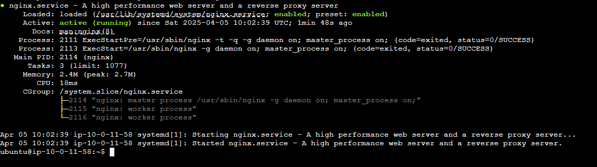
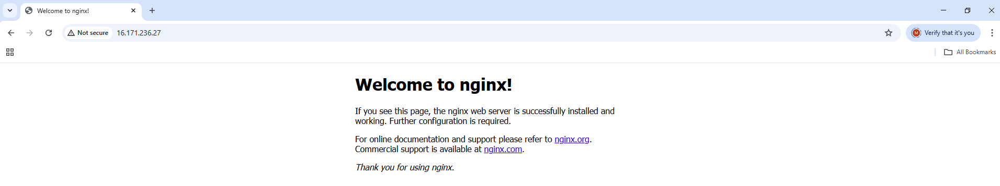
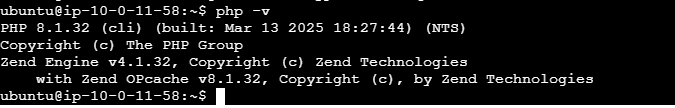
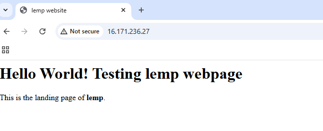
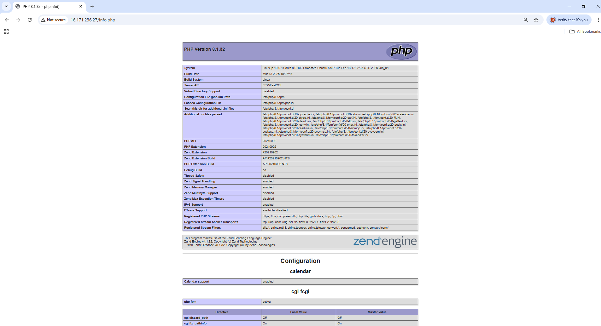

# Project-05
How To Install Linux, NginX, MySQL, PHP (LEMP) Stack on Ubuntu 22.04 using AWS EC2 instance as remote server

# Project Overview:
This project is focused on creating a web-based application utilizing the LAMP stack. The LAMP stack consists of a combination of four open-source technologies: Linux, Nginx, MySQL, and PHP/Perl/Python, which are commonly used for building and managing dynamic websites and web applications.

*   Linux is the operating system that provides the foundation for running the other components of the stack.

*   Nginx is a high-performance web server that will handle requests from users and serve content efficiently.

*   MySQL is a relational database management system (RDBMS) used to store and manage the application’s data in an organized way.

*   PHP, Perl, or Python are scripting languages that enable dynamic content generation and server-side logic, allowing the application to interact with the database and present data to users in real-time.

By leveraging these technologies, this project aims to develop a scalable and efficient application that can support a dynamic, data-driven user experience.

# Prerequisites:
1.  **AWS EC2 Instance:** An EC2 instance will serve as the hosting environment for the LAMP stack. It offers scalability and flexibility, making it ideal for web development projects that may need to grow or adapt over time.

2.  **AWS Security Group Configuration:** Ensure that the AWS Security Group associated with your EC2 instance allows all incoming traffic. However, this configuration is not recommended for production environments, as it can pose security risks. For production, you should implement more specific security settings to control and restrict access.

3.  **Ubuntu OS Selection:** Choose Ubuntu as the operating system when setting up your EC2 instance. Ubuntu is a popular and well-supported operating system, making it an excellent choice for hosting web applications due to its reliability and compatibility with a variety of software tools.

 # Step-by-Step Implementation:
##  Step 1 - Installing nginx
*   Update package manager
```
sudo apt update
```
*   Install nginx:
```
sudo apt install nginx
```
When prompted to confirm nginx installation, type "Y" on the keyboard, then ENTER.

*   Verify the status of nginx after installation with the syntax below:
```
sudo systemctl status nginx
```



Test nginx installation by accessing your server’s through the public IP address generated by EC2 on AWS in your web browser:
```
http://your_server_ip
```



## Step 2 — Installing MySQL
Now that the Nginx web server is up and running, the next step is to install a database system to store and manage your site's data. MySQL, a widely-used database management system, is commonly employed in PHP-based environments for efficient data handling and retrieval.
* Install MySQL Server:
```
sudo apt install mysql-server
```
Type "Y" then press "Enter" on the keyboard when prompted, to confirm installation.

Once the installation is complete, it is recommended to run the security script that comes pre-installed with MySQL. This script will help remove insecure default configurations and secure access to your database system.

* Open up MYSQL Prompt
```
sudo mysql
```
* Next, execute the following ALTER USER command to update the root user’s authentication method to use password-based authentication. In this example, the method is set to mysql_native_password:
```
ALTER USER 'root'@'localhost' IDENTIFIED WITH mysql_native_password BY 'password';
```
Exit the MySQL prompt after making the change
```
exit
```
*   Start the interactive script by running:
```
sudo mysql_secure_installation
```
This will ask if you want to configure the VALIDATE PASSWORD PLUGIN.

Note: Enabling this feature is a matter of discretion. When enabled, MySQL will reject any passwords that do not meet the defined criteria, returning an error. While it's generally safe to leave password validation disabled, it's strongly recommended to use strong, unique passwords for all database credentials.

During the setup process, you’ll be prompted with a series of questions regarding the removal of anonymous users and the test database. Confirm each step by typing Y and pressing ENTER.

## Step 3 — Installing PHP

With Nginx installed to serve content and MySQL set up to manage data, the next step is to install PHP, which processes code and generates dynamic content for users. Since Nginx doesn’t handle PHP natively, it relies on an external processor to bridge the gap between the web server and the PHP interpreter. This setup typically results in better performance for PHP-based websites, though it does require some additional configuration.  
 
You'll need to install **php8.1-fpm** (FastCGI Process Manager), which works with the current PHP version to handle PHP requests efficiently. Alongside it, install **php-mysql**, a module that enables PHP to interact with MySQL databases. Additionally, we’ll install **libapache2-mod-php** to allow Apache (if used) to process PHP files directly.

*   Run the following command below to install these packages
```
sudo apt install php8.1-fpm php-mysql
```
Once the installation is finished, run the following command to confirm your PHP version:
```
php -v
```
**Output**


The LEMP stack is now fully set up, but before testing it with a PHP script, it's recommended to configure an Nginx virtual host. This will provide a proper structure for organizing your website’s files and directories.

## Step 4 — Configuring Nginx to Use the PHP Processor
When working with the Nginx web server, you can create server blocks to manage configuration settings and host multiple domains on a single server. In this example, we’ll set up a domain called lemp.

On Ubuntu 22.04, Nginx comes with a default server block that serves content from the /var/www/html directory. While this setup is sufficient for a single website, it can become cumbersome when hosting multiple sites. Rather than modifying /var/www/html, we’ll create a dedicated directory structure under /var/www for the lemp site. This approach preserves the default directory for fallback use when a client request doesn’t match any configured site.

*   Create the directory for lemp domain as follows:
```
sudo mkdir /var/www/lemp
```
*   Next, assign ownership of the directory to your current system user by using the $USER environment variable, which automatically refers to the user you're logged in as:
```
sudo chown -R $USER:$USER /var/www/lemp
```
*   Then, open a new configuration file in Nginx’s sites-available directory using your preferred command-line editor. Here, we’ll use vim:
```
sudo vi /etc/nginx/sites-available/lemp
```
*   This will create a new blank file. Add in the following bare-bones configuration with your own domain name:

```
server {
    listen 80;
    server_name lemp www.lemp;
    root /var/www/lemp;

    index index.html index.htm index.php;

    location / {
        try_files $uri $uri/ =404;
    }

    location ~ \.php$ {
        include snippets/fastcgi-php.conf;
        fastcgi_pass unix:/var/run/php/php8.1-fpm.sock;
     }

    location ~ /\.ht {
        deny all;
    }

}
```
Once you’ve finished editing the file, save and close it. If you're using vim, press Esc, then type :wq and hit ENTER.


*   Activate your configuration by linking to the configuration file from Nginx’s sites-enabled directory:
```
sudo ln -s /etc/nginx/sites-available/lemp /etc/nginx/sites-enabled/
```
*   Next, unlink the default configuration file from the /sites-enabled/ directory:
```
sudo unlink /etc/nginx/sites-enabled/default
```
Test your configuration for syntax errors by running the following:
```
sudo nginx -t
```
If you see the following output, everything is set up correctly and you're good to go.

```nginx: the configuration file /etc/nginx/nginx.conf syntax is ok nginx: configuration file /etc/nginx/nginx.conf test is successful```

* Reload Nginx to effect this change:
```
sudo systemctl reload nginx
```
Your new website is now active, but the web root /var/www/lemp is still empty. Create an index.html file in that location to test that the server block works as expected:
```
sudo vi /var/www/lemp/index.html
```
*   Include the following content below into the file created above:
```
<html>
  <head>
    <title>lemp website</title>
  </head>
  <body>
    <h1>Hello World! Testing lemp webpage</h1>

    <p>This is the landing page of <strong>lemp</strong>.</p>
  </body>
</html>
```
*   Go to your browser and access your server’s domain name or IP address:
```
http://server_domain_or_IP
```


##  Step 5 — Testing PHP with Nginx
With your custom directory in place to host your website’s files, the next step is to create a PHP test script to verify that Nginx can correctly handle and process PHP file requests.

*   Create a new file named info.php inside your custom web root folder:
```
sudo vi /var/www/lemp/info.php
```
*   This will open a blank file. Add the following text, which is valid PHP code, inside the file:
```
<?php
phpinfo();
```
When you are done, save and close the file.

To test this script, go to your web browser and access your server’s domain name or IP address, followed by the script name, which in this case is /info.php:
```
http://server_domain_or_IP/info.php
```


## Chapter 6
### Possible blocker in "Step 3"
If you encounter an error message as shown below

* Run the following commands to resolve it
```
sudo apt update
sudo apt install software-properties-common
sudo add-apt-repository ppa:ondrej/php
sudo apt update
```

Then try to instal it again

*   Conclusion

In this guide, we've successfully installed and configured the LEMP stack on Ubuntu 22.04, creating a solid foundation for web development. With Linux as the operating system, Nginx as the web server, MySQL as the database management system, and PHP as the server-side scripting language, we now have a flexible platform for building dynamic websites and web applications.

Note: Remember to terminate your EC2 instance once you've completed this project.

Project Completed!🎉